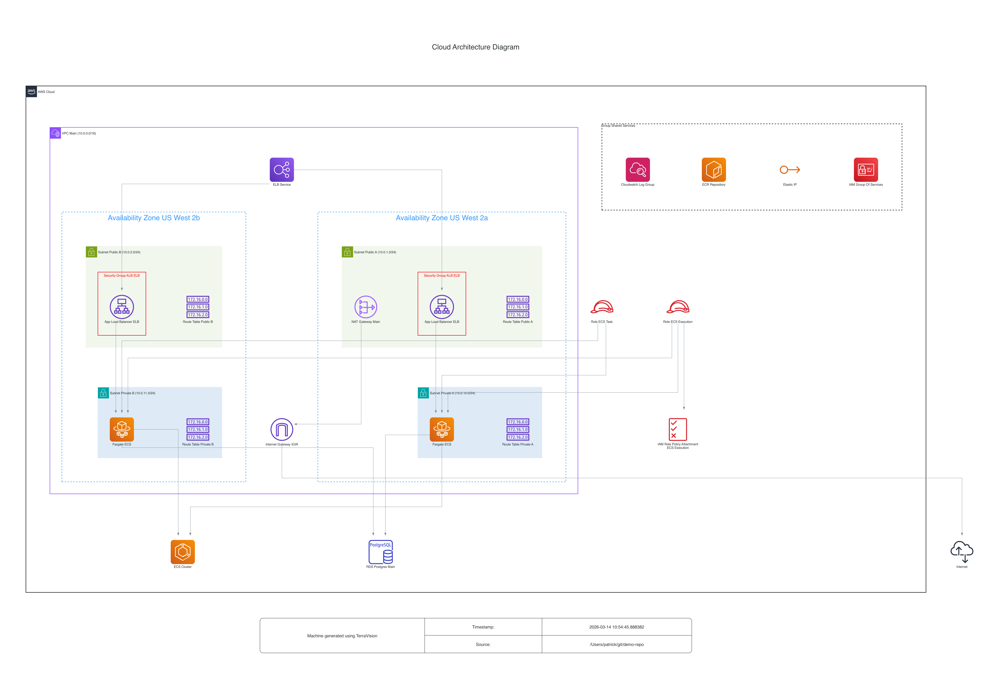

# AWS Web Application Infrastructure

Production-ready three-tier web application on AWS using ECS Fargate, with WAF protection and PostgreSQL database.

## Architecture



> This diagram is **automatically generated** from the Terraform source code using [Terravision](https://github.com/patrickchugh/terravision) and updated on every commit via GitHub Actions.

## Components

| Layer | Service | Purpose |
|-------|---------|---------|
| Edge | WAF WebACL | Rate limiting, common exploit protection |
| Load Balancing | Application Load Balancer | HTTPS termination, traffic distribution |
| Compute | ECS Fargate | Containerized application (2 tasks, multi-AZ) |
| Database | RDS PostgreSQL | Multi-AZ relational database with encryption |
| Networking | VPC | Public/private subnets across 2 AZs, NAT Gateway |
| Monitoring | CloudWatch | Centralized logging for ECS tasks |

## Deployment

```bash
terraform init
terraform plan
terraform apply
```

## How the Diagram Auto-Updates

This repo includes a [GitHub Actions workflow](.github/workflows/architecture-diagrams.yml) that runs [Terravision](https://github.com/patrickchugh/terravision) whenever `.tf` files change on `main`. The workflow generates a fresh architecture diagram and commits it back to the repo, so the diagram above always reflects the current infrastructure.
